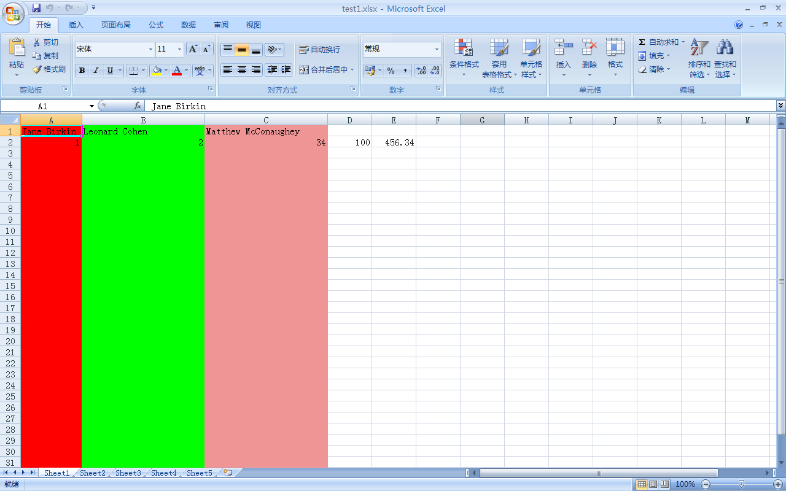

A Open Xml  Spreadsheet(.xlsx) reader and writer for Racket
==================

# Install
    raco pkg install simple-xlsx

# Basic Usage
```racket

  (require simple-xlsx)
  
  ;; write a xlsx file, with multiple sheets, set the column attributes(width, color)
  (let ([xlsx (new xlsx-data%)]
        [col_attr_hash (make-hash)])
      (hash-set! col_attr_hash "A" (col-attr 100 "FF0000"))
      (hash-set! col_attr_hash "B" (col-attr 200 "00FF00"))
      (hash-set! col_attr_hash "C" (col-attr 200 "EF9595"))
      (hash-set! col_attr_hash "D-F" (col-attr 100 "0000FF"))
      (hash-set! col_attr_hash "7-10" (col-attr 100 "EE89CD"))
  
      (send xlsx add-sheet '(("Jane Birkin" "Leonard Cohen" "Matthew McConaughey") (1 2 34 100 456.34)) "Sheet1" #:col_attr_hash col_attr_hash)
      (send xlsx add-sheet '((1 2 3 4)) "Sheet2")
      (send xlsx add-sheet '(("a" "b")) "Sheet3")
      (send xlsx add-sheet '(("a" "b")) "Sheet4" #:col_attr_hash col_attr_hash)
      (send xlsx add-sheet '(("")) "Sheet5" #:col_attr_hash col_attr_hash)
      (write-xlsx-file xlsx "test1.xlsx"))
  
  ;; write a xlsx file and read it back
  (let ([xlsx (new xlsx-data%)])
    (send xlsx add-sheet '(("chenxiao" "cx") (1 2 34 100 456.34)) "Sheet1")
    (send xlsx add-sheet '((1 2 3 4)) "Sheet2")
    (send xlsx add-sheet '(("")) "Sheet3")
    (write-xlsx-file xlsx "test2.xlsx")
  
    ;; read specific cell
    (with-input-from-xlsx-file
     "test2.xlsx"
     (lambda (xlsx)
       (printf "~a\n" (get-sheet-names xlsx)) ;(Sheet1 Sheet2 Sheet3)
       
       (load-sheet "Sheet1" xlsx)
  
       (printf "~a\n" (get-sheet-dimension xlsx)) ; (2 . 5)
       (printf "~a\n" (get-cell-value "A1" xlsx)) ; "chenxiao"
       (printf "~a\n" (get-cell-value "B1" xlsx)) ; "cx"
       (printf "~a\n" (get-cell-value "E2" xlsx)))) ; 456.34
  
    ;; loop for row
    (with-input-from-xlsx-file
      "test2.xlsx"
      (lambda (xlsx)
        (load-sheet "Sheet1" xlsx)
        (with-row xlsx
                  (lambda (row)
                    (printf "~a\n" (first row))))))) ;; chenxiao 1
  
```


